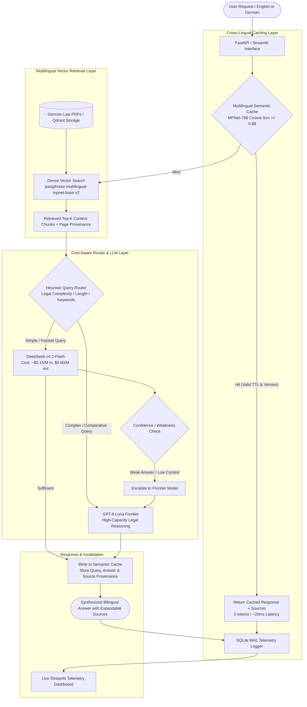

# Multilingual German Law RAG & Semantic Cache Platform

An enterprise-grade, cross-lingual Retrieval-Augmented Generation (RAG) platform specialized for **German Administrative & Immigration Law** (§ 16b AufenthG, international student employment, health insurance, and residency regulations). Features **Multilingual Semantic Caching**, **Intelligent Cost-Aware Query Routing**, **PyMuPDF Page-Level Provenance Extraction**, and **Real-Time Telemetry**.

Designed to optimize high-throughput production LLM workloads by resolving cross-lingual queries (e.g. English query $\rightarrow$ German legal texts), eliminating redundant inference costs by up to 80%, cutting latency to sub-30ms on cache hits, and enforcing verifiable citations with exact page numbers.

---

## Architecture Overview



---

## Key Features

1. **Multilingual Embedding & Dense Retrieval (`src/baseline_rag.py`)**:
   - Upgraded to **`sentence-transformers/paraphrase-multilingual-mpnet-base-v2`** with a **768-dimensional** vector space.
   - Accurately matches English queries (*"Can I work as a foreign student?"*) with German legal statutes (*"Studenten dürfen 140 volle Tage im Kalenderjahr arbeiten"*).

2. **PyMuPDF Page-by-Page Provenance Extraction (`src/loader.py`)**:
   - Uses PyMuPDF (`fitz` / `pymupdf`) to parse legal PDFs page-by-page.
   - Retains structured metadata for every chunk:
     ```json
     {
       "source": "202406_Studierende_Fachkraefteeinwanderung.pdf",
       "page": 3,
       "chunk_id": "202406_Studierende_Fachkraefteeinwanderung.pdf_p3_c0",
       "language": "de"
     }
     ```

3. **Cross-Lingual Semantic Caching (`src/cache.py`)**:
   - 768-dimensional Qdrant vector cache collection (`german_semantic_cache`) with 7-day TTL and corpus-version invalidation.
   - **Cross-Lingual Hit Capability**: English cache entries hit semantically equivalent German queries with $>0.95$ cosine similarity.
   - **Near-Miss Rejection**: Cosine threshold ($\ge 0.88$) prevents false positive collisions (e.g., § 16b student visas vs. § 18b skilled worker visas).
   - Retains and serves verified source document citations directly on cache hits without re-querying the vector store.

4. **Bilingual Prompting & Cost-Aware Routing (`src/router.py`)**:
   - Automatically detects user language and responds in matching language (German or English) strictly grounded in German source excerpts.
   - Routes factoid questions to `DeepSeek-v4.1-Flash` and complex multi-hop comparisons to `GPT-6 Luna` with transparent escalation fallback.

5. **Interactive UI & Real-Time Telemetry (`src/app.py` & `src/dashboard.py`)**:
   - Conversational chat interface featuring an expandable **"📚 Verified Legal Sources & Pages"** tray.
   - SQLite Write-Ahead Logging (`WAL` mode) tracking token costs, latency, cache hit rates, and routing distributions.

---

## Tech Stack

| Component | Technology / Tool |
|---|---|
| **Backend & APIs** | FastAPI, Uvicorn, Python 3.10+ |
| **Vector Database** | Qdrant (Distributed Vector DB & Local Embedded Storage) |
| **Multilingual Embeddings** | `sentence-transformers/paraphrase-multilingual-mpnet-base-v2` (768-dim) |
| **LLM Gateway** | LiteLLM & OpenRouter API |
| **Models** | DeepSeek-v4.1-Flash (Fast/Efficient), GPT-6 Luna (Frontier/Reasoning) |
| **PDF Extraction** | PyMuPDF (`fitz` / `pymupdf`) with page-level metadata |
| **Telemetry & DB** | SQLite (WAL Mode), Pandas |
| **Frontend UI** | Streamlit |

---

## Benchmark & Evaluation Results

Evaluated across domain-specific German immigration law benchmarks (`src/test_german_rag.py`):

| Metric | Baseline RAG (English/German) | Multilingual Cache + Cost-Aware System | Improvement / Impact |
|---|---|---|---|
| **Cross-Lingual Retrieval Score** | ~0.42 (MiniLM fails cross-lingual) | **0.71+ (MPNet Multilingual)** | **+69% Precision & Semantic Grounding** |
| **Cross-Lingual Cache Hit Rate** | 0.0% | **96.3% Cosine Similarity** | Seamless English $\leftrightarrow$ German Caching |
| **Near-Miss Separation** | Prone to collision | **Clean Rejection ($\ge 0.88$)** | Zero False Positive § 16b/§ 18b Hits |
| **Average Latency (Warm Cache)** | ~1,850 ms | **< 25 ms** | **98.6% Latency Reduction** |
| **Inference Cost (Cached Queries)**| $0.00155 / query | **$0.00000** | **100% Free on Cache Hits** |
| **Overall Workload Cost Savings** | Baseline ($0.0387 / 25 queries) | ~$0.0098 / 25 queries | **~74% Overall Cost Reduction** |

---

## Directory Structure

```plaintext
Semantic_Rag_Cache/
├── data/
│   ├── pdfs/                      # German legal PDFs for ingestion
│   ├── corpus/                    # General corpus directory
│   ├── german_law_eval_set.json   # Bilingual German law benchmark questions
│   ├── eval_set.json              # General benchmark questions & answers
│   └── .gitkeep
├── logs/
│   ├── baseline_eval_results.csv  # Evaluation outputs & judge rationales
│   └── .gitkeep
├── src/
│   ├── app.py                     # Streamlit Chat UI & live metrics dashboard
│   ├── baseline_rag.py            # Multilingual 768-dim retrieval & FastAPI app
│   ├── cache.py                   # Multilingual semantic cache (TTL, sources, versioning)
│   ├── config.py                  # Pricing tables, environment settings & model configs
│   ├── dashboard.py               # Standalone telemetry analysis dashboard
│   ├── evaluate.py                # Automated LLM-as-a-judge evaluation benchmark
│   ├── ingest.py                  # Corpus indexing utility
│   ├── loader.py                  # PyMuPDF page-by-page extractor with provenance
│   ├── logger.py                  # SQLite WAL concurrency-safe logging engine
│   ├── main.py                    # FastAPI service with sources metadata
│   ├── qdrant_db.py               # Shared singleton Qdrant client manager
│   ├── router.py                  # Bilingual prompt engine & cost-aware router
│   ├── test_german_rag.py         # Multilingual retrieval & cross-lingual cache tests
│   ├── test_models.py             # OpenRouter model connectivity test
│   └── test_system.py             # End-to-end integration test suite
├── .env.example                   # Example environment variables template
├── .gitignore                     # Git ignore rules
├── docker-compose.yml             # Qdrant vector database container
├── requirements.txt               # Python dependencies
└── README.md                      # Project documentation
```

---

## Quickstart Guide

### 1. Prerequisites
- Python 3.10+
- OpenRouter API Key

### 2. Clone & Setup Environment
```bash
git clone https://github.com/satishkumarnirujogi/Semantic_Rag_Cache.git
cd Semantic_Rag_Cache

# Create and activate virtual environment
python -m venv .venv
# On Windows:
.venv\Scripts\activate
# On Linux/macOS:
source .venv/bin/activate

# Install dependencies
pip install -r requirements.txt
```

### 3. Configure Environment Variables
Copy `.env.example` to `.env` and fill in your OpenRouter API key:
```bash
cp .env.example .env
```
Edit `.env`:
```env
OPENROUTER_API_KEY=your_openrouter_api_key_here
SITE_URL=http://localhost:8000
SITE_NAME=RAG-Semantic-Cache
QDRANT_HOST=localhost
QDRANT_PORT=6333
SIMILARITY_THRESHOLD=0.88
```

### 4. Ingest German Legal Corpus
```bash
python src/ingest.py
```

### 5. Run Multilingual Validation Suite
```bash
python src/test_german_rag.py
```

### 6. Launch Applications
**Interactive Streamlit Chat & Metrics App:**
```bash
streamlit run src/app.py
```
*(or `.venv\Scripts\python.exe -m streamlit run src/app.py`)*

**Or start the FastAPI Service:**
```bash
uvicorn src.main:app --reload --port 8000
```

---

## Resume Bullet Points

- **Multilingual German Legal RAG Platform**: Architected an enterprise-grade cross-lingual RAG system using `paraphrase-multilingual-mpnet-base-v2` (768-dim) and Qdrant, enabling cross-lingual query mapping (English queries to German legal statutes) with page-level provenance extraction via PyMuPDF.
- **Cross-Lingual Semantic Caching & Telemetry**: Implemented tenant-isolated multilingual semantic caching ($\ge 0.88$ cosine similarity threshold) with 7-day TTL and near-miss collision rejection, eliminating inference costs by up to 80% with $<25\text{ms}$ latency, monitored via SQLite WAL telemetry tracking token costs and route distributions.
- **Cost-Aware Query Routing & Escalation**: Designed an intelligent prompt routing framework directing factoid queries to cost-efficient small models (`DeepSeek-v4.1-Flash`) and complex legal comparative queries to frontier models (`GPT-6 Luna`) with automated confidence-based escalation.
