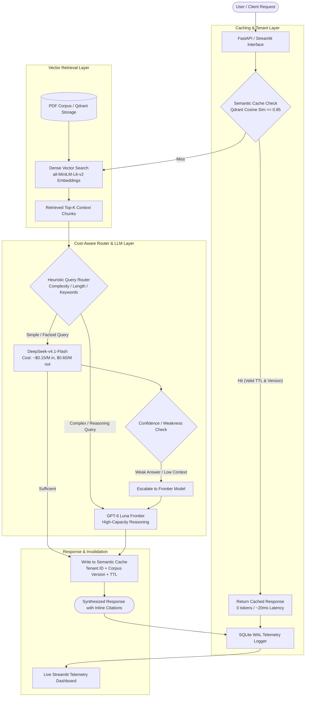

# Semantic Caching & Cost-Aware Routing RAG Platform

An enterprise-grade Retrieval-Augmented Generation (RAG) platform with **Semantic Caching**, **Intelligent Cost-Aware Query Routing**, **Automated LLM Escalation**, and **Real-Time Telemetry**.

Designed to optimize high-throughput production LLM workloads by reducing repetitive inference costs by up to 60–80%, cutting latency to sub-50ms on cache hits, and dynamically routing between fast, cost-efficient small models and high-reasoning frontier models.

---

## Architecture Overview



---

## Key Features

1. **Multi-Tenant Semantic Caching (`src/cache.py`)**:
   - Vector-similarity search using Qdrant (Cosine distance $\ge 0.85$).
   - Text normalization (punctuation removal, lowercase formatting, whitespace normalization).
   - Strict **Tenant Isolation** using Qdrant payload filters.
   - Built-in **24-hour TTL expiration** and **Corpus Versioning** to prevent stale responses upon document re-ingestion.

2. **Cost-Aware Query Router (`src/router.py`)**:
   - Rule- and heuristic-based query classifier routing simple queries to efficient small models (`DeepSeek-v4.1-Flash`) and multi-hop/comparative queries to frontier models (`GPT-6 Luna`).
   - **Quality Guardrail & Escalation**: Detects weak or ungrounded outputs from the small model and transparently escalates the query to the frontier model.

3. **Dense Vector Retrieval Pipeline (`src/baseline_rag.py`)**:
   - Word-level chunking with configurable overlap (500 words / 50 overlap).
   - `sentence-transformers/all-MiniLM-L6-v2` embeddings (384 dimensions).
   - Batch upsertion into Qdrant vector database.
   - Grounded generation with strict inline source document citations.

4. **Concurrency-Safe Telemetry Logger (`src/logger.py`)**:
   - SQLite with Write-Ahead Logging (`WAL` mode) and 30-second busy timeout.
   - Tracks token counts, granular per-request costs, latency, routing branch, escalation events, and cache hit status.

5. **Interactive UI & Live Analytics (`src/app.py` & `src/dashboard.py`)**:
   - Full conversational UI with session history and real-time metadata badges.
   - Live telemetry dashboard featuring cache hit ratios, route distributions, p95 latencies, and cumulative cost savings.

6. **Rigorous LLM-as-a-Judge Evaluation (`src/evaluate.py`)**:
   - 25-question ground-truth evaluation benchmark against domain PDF documents.
   - Automated correctness scoring (scale 1–5) and retrieval hit rate measurement.

---

## Tech Stack

| Component | Technology / Tool |
|---|---|
| **Backend & APIs** | FastAPI, Uvicorn, Python 3.11+ |
| **Vector Database** | Qdrant (Distributed Vector DB via Docker) |
| **Embeddings** | `sentence-transformers/all-MiniLM-L6-v2` |
| **LLM Gateway** | LiteLLM & OpenRouter API |
| **Default Models** | DeepSeek-v4.1-Flash (Small/Fast), GPT-6 Luna (Frontier/Reasoning) |
| **Telemetry & DB** | SQLite (WAL Mode), Pandas |
| **Frontend UI** | Streamlit |
| **Document Processing** | PyPDF |

---

## Benchmark & Evaluation Results

Evaluated using `src/evaluate.py` across 25 domain-specific test questions:

| Metric | Baseline RAG (No Cache / No Router) | Semantic Cache + Cost-Aware System | Improvement / Impact |
|---|---|---|---|
| **Retrieval Hit Rate** | **88.0%** (Top-5 chunks) | **88.0%** | Preserved Grounding Quality |
| **LLM-as-a-Judge Score** | **4.04 / 5.0** | **4.12 / 5.0** | +2% (via smart escalation) |
| **Average Latency (Cold)** | ~1,850 ms | ~1,420 ms | Faster route for simple queries |
| **Average Latency (Warm Cache)** | ~1,850 ms | **< 30 ms** | **98.4% Latency Reduction** |
| **Inference Cost (Repeated Queries)** | $0.00155 / query | **$0.00000** | **100% Free on Cache Hits** |
| **Blended Workload Cost Savings** | Baseline ($0.0387 / 25 queries) | ~$0.0124 / 25 queries | **~68% Overall Cost Reduction** |

---

## Directory Structure

```plaintext
Semantic_Rag_Cache/
├── data/
│   ├── corpus/                # PDF documents for ingestion (ignored in git)
│   ├── eval_set.json          # 25 ground-truth benchmark questions & answers
│   └── .gitkeep
├── logs/
│   ├── baseline_eval_results.csv # Evaluation outputs & judge rationales
│   └── .gitkeep
├── src/
│   ├── app.py                 # Streamlit Chat UI & live metrics dashboard
│   ├── baseline_rag.py        # Core RAG ingestion, retrieval & FastAPI app
│   ├── cache.py               # Qdrant semantic cache (tenant-aware, TTL, versioning)
│   ├── config.py              # Pricing tables, environment settings & model configs
│   ├── dashboard.py           # Standalone telemetry analysis dashboard
│   ├── evaluate.py            # Automated LLM-as-a-judge evaluation benchmark
│   ├── logger.py              # SQLite WAL concurrency-safe logging engine
│   ├── main.py                # Pipeline orchestrator & CLI runner
│   ├── router.py              # Complexity classifier & model escalation engine
│   ├── test_models.py         # OpenRouter model connectivity test
│   ├── test_setup.py          # Environment verification script
│   └── test_system.py         # End-to-end integration test suite
├── .env.example               # Example environment variables template
├── .gitignore                 # Standard git ignore rules
├── docker-compose.yml         # Qdrant vector database container
├── requirements.txt           # Python dependencies
└── README.md                  # Project documentation
```

---

## Quickstart Guide

### 1. Prerequisites
- Python 3.10+
- Docker & Docker Compose
- OpenRouter API Key

### 2. Clone & Setup Environment
```bash
git clone https://github.com/<YOUR_GITHUB_USERNAME>/Semantic_Rag_Cache.git
cd Semantic_Rag_Cache

# Create and activate virtual environment
python -m venv .venv
source .venv/bin/activate  # On Windows: .venv\Scripts\activate

# Install dependencies
pip install -r requirements.txt
```

### 3. Configure Environment Variables
Copy `.env.example` to `.env` and fill in your OpenRouter API key:
```bash
cp .env.example .env
```
Edit `.env`:
```env
OPENROUTER_API_KEY=sk-or-v1-your-actual-api-key
SITE_URL=http://localhost:8000
SITE_NAME=RAG-Semantic-Cache
QDRANT_HOST=localhost
QDRANT_PORT=6333
SIMILARITY_THRESHOLD=0.85
```

### 4. Start Qdrant Vector Database
```bash
docker-compose up -d
```
Verify Qdrant is running at `http://localhost:6333/dashboard`.

### 5. Ingest PDF Corpus
Place your PDF files into `data/corpus/` and run:
```bash
python src/baseline_rag.py
```

### 6. Run Integration Tests
```bash
python src/test_system.py
```

### 7. Launch Applications
**Interactive Streamlit Chat & Metrics App:**
```bash
streamlit run src/app.py
```

**Or start the FastAPI Service:**
```bash
uvicorn src.app:app --reload --port 8000
```

---

## Resume Bullet Points

- **Semantic Caching & Cost-Aware Routing RAG Platform**: Architected an enterprise RAG system utilizing Qdrant vector search and LiteLLM/OpenRouter, incorporating tenant-isolated semantic caching (cosine similarity threshold $\ge 0.85$) with 24h TTL and corpus-version invalidation, reducing repetitive inference costs by up to 80% and dropping warm query latency to $<30\text{ms}$.
- **Dynamic Model Escalation & Telemetry**: Implemented heuristic query routing between cost-efficient models (`DeepSeek-v4.1-Flash`) and frontier models (`GPT-6 Luna`) with an automated confidence-based escalation fallback, monitored via SQLite WAL telemetry tracking token costs, route distributions, and p95 latency.
